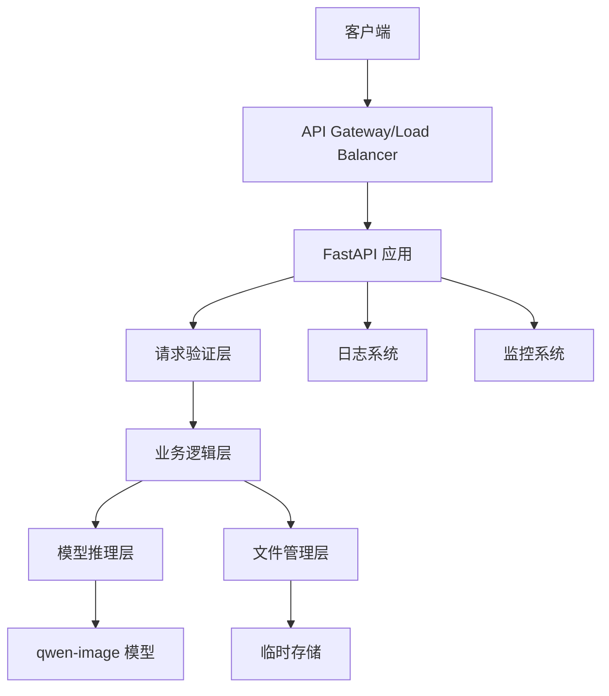

# 设计文档

## 概述

本设计文档描述了基于 qwen-image 模型的 Python API 服务架构。该服务采用 FastAPI 框架构建，提供 RESTful API 接口，支持文生图和图生图功能。系统设计重点关注性能优化、错误处理和资源管理。

## 架构

### 整体架构



### 分层架构

1. **API 层** - FastAPI 路由和中间件
2. **业务逻辑层** - 请求处理和响应格式化
3. **模型推理层** - qwen-image 模型封装和推理
4. **数据层** - 文件处理和临时存储管理

## 组件和接口

### 核心组件

#### 1. API 服务器 (FastAPI Application)

```python
# 主要端点
POST /text-to-image
POST /image-to-image  
GET /health
GET /info
```

**职责：**
- HTTP 请求路由
- 请求验证和参数解析
- 响应格式化
- 错误处理

#### 2. 模型管理器 (ModelManager)

```python
class ModelManager:
    def __init__(self, model_path: str, config: dict)
    def load_model(self) -> None
    def text_to_image(self, prompt: str, **kwargs) -> Image
    def image_to_image(self, image: Image, prompt: str, **kwargs) -> Image
    def is_model_loaded(self) -> bool
```

**职责：**
- qwen-image 模型加载和初始化
- 推理请求处理
- 模型状态管理
- 内存优化

#### 3. 请求处理器 (RequestProcessor)

```python
class RequestProcessor:
    def validate_text_request(self, request: TextToImageRequest) -> bool
    def validate_image_request(self, request: ImageToImageRequest) -> bool
    def process_image_upload(self, file: UploadFile) -> Image
    def format_response(self, image: Image) -> dict
```

**职责：**
- 输入验证
- 图像预处理
- 响应格式化
- 错误处理

#### 4. 配置管理器 (ConfigManager)

```python
class ConfigManager:
    def load_config(self, config_path: str) -> dict
    def get_model_config(self) -> dict
    def get_server_config(self) -> dict
    def validate_config(self) -> bool
```

**职责：**
- 配置文件加载
- 参数验证
- 默认值管理

### 接口定义

#### API 接口

**文生图接口**
```
POST /text-to-image
Content-Type: application/json

Request Body:
{
    "prompt": "string (required)",
    "width": "integer (optional, default: 512)",
    "height": "integer (optional, default: 512)", 
    "num_inference_steps": "integer (optional, default: 20)",
    "guidance_scale": "float (optional, default: 7.5)"
}

Response:
{
    "success": true,
    "image": "base64_encoded_string",
    "metadata": {
        "width": 512,
        "height": 512,
        "inference_time": 2.5
    }
}
```

**图生图接口**
```
POST /image-to-image
Content-Type: multipart/form-data

Form Data:
- image: file (required)
- prompt: string (required)
- strength: float (optional, default: 0.8)
- width: integer (optional)
- height: integer (optional)
- num_inference_steps: integer (optional, default: 20)

Response: 同文生图接口
```

## 数据模型

### 请求模型

```python
from pydantic import BaseModel, Field
from typing import Optional

class TextToImageRequest(BaseModel):
    prompt: str = Field(..., min_length=1, max_length=1000)
    width: Optional[int] = Field(512, ge=256, le=2048)
    height: Optional[int] = Field(512, ge=256, le=2048)
    num_inference_steps: Optional[int] = Field(20, ge=1, le=100)
    guidance_scale: Optional[float] = Field(7.5, ge=1.0, le=20.0)

class ImageToImageRequest(BaseModel):
    prompt: str = Field(..., min_length=1, max_length=1000)
    strength: Optional[float] = Field(0.8, ge=0.1, le=1.0)
    width: Optional[int] = Field(None, ge=256, le=2048)
    height: Optional[int] = Field(None, ge=256, le=2048)
    num_inference_steps: Optional[int] = Field(20, ge=1, le=100)
```

### 响应模型

```python
class ImageResponse(BaseModel):
    success: bool
    image: str  # base64 encoded
    metadata: dict
    error: Optional[str] = None

class HealthResponse(BaseModel):
    status: str
    model_loaded: bool
    memory_usage: dict
    uptime: float

class InfoResponse(BaseModel):
    service_name: str
    version: str
    model_info: dict
    supported_formats: list
```

### 配置模型

```python
class ModelConfig(BaseModel):
    model_path: str
    device: str = "cuda"
    torch_dtype: str = "float16"
    max_memory: Optional[str] = None

class ServerConfig(BaseModel):
    host: str = "0.0.0.0"
    port: int = 8000
    max_file_size: int = 10 * 1024 * 1024  # 10MB
    max_concurrent_requests: int = 4
    request_timeout: int = 300  # 5 minutes
```

## 错误处理

### 错误分类

1. **客户端错误 (4xx)**
   - 400: 请求参数无效
   - 413: 文件过大
   - 415: 不支持的媒体类型
   - 429: 请求过于频繁

2. **服务器错误 (5xx)**
   - 500: 模型推理失败
   - 503: 服务不可用（模型未加载或资源不足）

### 错误处理策略

```python
class ErrorHandler:
    def handle_validation_error(self, error: ValidationError) -> JSONResponse
    def handle_model_error(self, error: Exception) -> JSONResponse
    def handle_file_error(self, error: Exception) -> JSONResponse
    def handle_timeout_error(self, error: TimeoutError) -> JSONResponse
```

### 错误响应格式

```json
{
    "success": false,
    "error": {
        "code": "INVALID_PROMPT",
        "message": "提示词不能为空",
        "details": {}
    }
}
```

## 测试策略

### 单元测试

1. **模型管理器测试**
   - 模型加载测试
   - 推理功能测试
   - 错误处理测试

2. **API 端点测试**
   - 请求验证测试
   - 响应格式测试
   - 错误场景测试

3. **工具函数测试**
   - 图像处理函数
   - 配置加载函数
   - 验证函数

### 集成测试

1. **端到端测试**
   - 文生图完整流程
   - 图生图完整流程
   - 并发请求处理

2. **性能测试**
   - 推理速度测试
   - 内存使用测试
   - 并发处理能力测试

### 测试工具和框架

- **pytest** - 单元测试框架
- **httpx** - API 测试客户端
- **pytest-asyncio** - 异步测试支持
- **pytest-mock** - 模拟对象
- **locust** - 性能测试

### 测试数据

- 标准测试提示词集合
- 不同尺寸的测试图像
- 边界条件测试用例
- 性能基准测试数据

## 部署和运维

### 容器化

```dockerfile
# 使用 Python 3.9 基础镜像
FROM python:3.9-slim

# 安装系统依赖
RUN apt-get update && apt-get install -y \
    libgl1-mesa-glx \
    libglib2.0-0

# 设置工作目录
WORKDIR /app

# 复制依赖文件
COPY requirements.txt .
RUN pip install -r requirements.txt

# 复制应用代码
COPY . .

# 暴露端口
EXPOSE 8000

# 启动命令
CMD ["uvicorn", "main:app", "--host", "0.0.0.0", "--port", "8000"]
```

### 监控和日志

1. **日志记录**
   - 结构化日志格式
   - 不同级别的日志
   - 请求追踪 ID

2. **监控指标**
   - 请求响应时间
   - 错误率
   - 内存和 GPU 使用率
   - 并发请求数

3. **健康检查**
   - 模型状态检查
   - 资源使用检查
   - 依赖服务检查